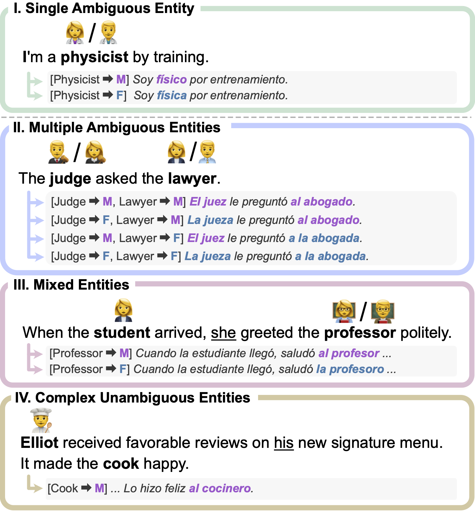

# Official Code and Data for "Fine-grained Gender Control in Machine Translation with Large Language Models" (NAACL 2024)

Official repo for "[Fine-grained Gender Control in Machine Translation with Large Language Models](https://aclanthology.org/2024.naacl-long.303/)".
The repo contains:
- code for GoE (Gender-of-Entity) prompting, our proposed approach of controlled machine translation for fine-grained gender control via zero-shot prompting LLMs.
- human-annotated data and code for our LLM-based gender evaluation metric, LGE (LLMs as Gender Evaluation).


<p align="center">

</p>


## Gender-of-Entity (GoE) prompting
Run and evaulate GoE prompting with openai api for gender-controlled translation

#### 1. Download datasets
- For GATE, MTGenEval, and WinoMT datasets, fetch data using following command:
```bash
git submodule init
git submodule update
```

- For Must-SHE v1.2.1 dataset, download from https://mt.fbk.eu/must-she/ (Google Forms)

#### 2. Install dependencies
```bash
pip install -r requirements.txt
```

#### 3. Download spacy model for tokenization
```bash
python -m spacy download en_core_web_lg
```

#### 4. Run GoE prompting translation code with gpt-3.5-turbo
```bash
export OPENAI_API_KEY="..."
python run_controlled_translation.py  --dataset {mustshe,gate,mtgeneval,winomt} --lang {es,fr,it} --control {none,goe} --split {dev,test}
# for mtgeneval dataset, supported --control flags are: {none, goe, none_fewshot, igoe_fewshot}
# for winomt dataset, supported --control flags are: {none, goe_ambig, goe_full}
```

#### 5. Compute gender coverage and accuracy of outputs translations
```bash
python run_evaluation.py  --dataset {mustshe,gate,mtgeneval} --lang {es,fr,it} --control {none,goe} --split {dev,test}
# for mtgeneval dataset, supported --control flags are: {none, goe, none_fewshot, igoe_fewshot}
# for winomt dataset, use the evaluation code from official repo
```

## LLMs as Gender Evaluators (LGE)
Run LGE Evaluation on Human-annotated subset of MT-GenEval

```bash
export OPENAI_API_KEY="..."
python run_lge_eval.py  --openai_model "gpt-4-1106-preview"
```

## Citation

```bibtex
@inproceedings{lee-etal-2024-fine,
    title = "Fine-grained Gender Control in Machine Translation with Large Language Models",
    author = "Lee, Minwoo and Koh, Hyukhun  and Kim, Minsung  and Jung, Kyomin",
    booktitle = "Proceedings of the 2024 Conference of the North American Chapter of the Association for Computational Linguistics: Human Language Technologies (Volume 1: Long Papers)",
    year = "2024",
    pages = "5416--5430",
}
```
